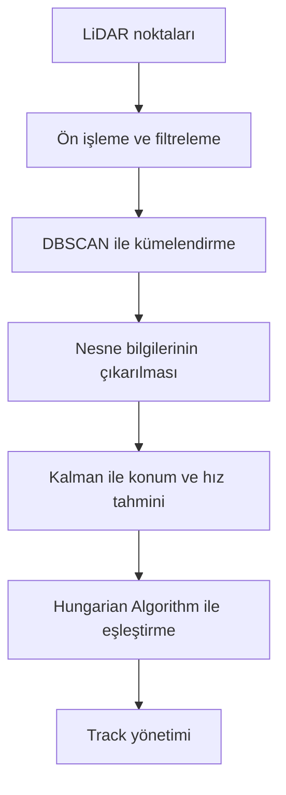
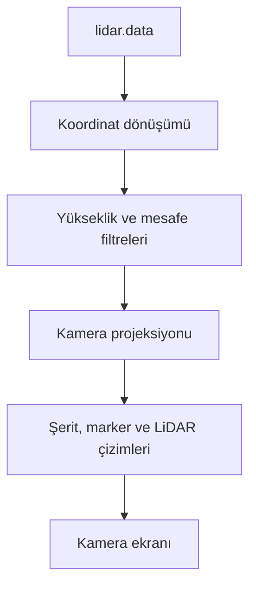
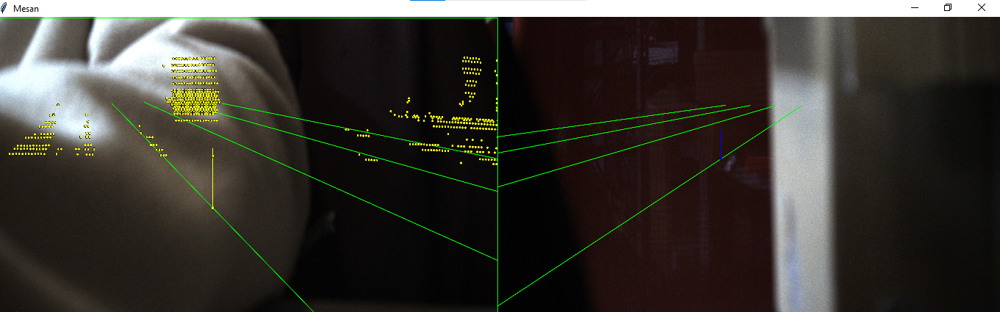
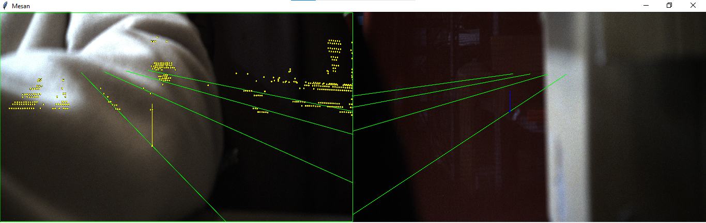
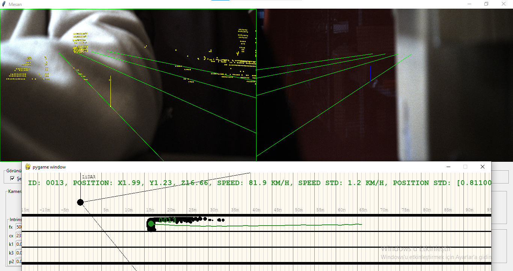
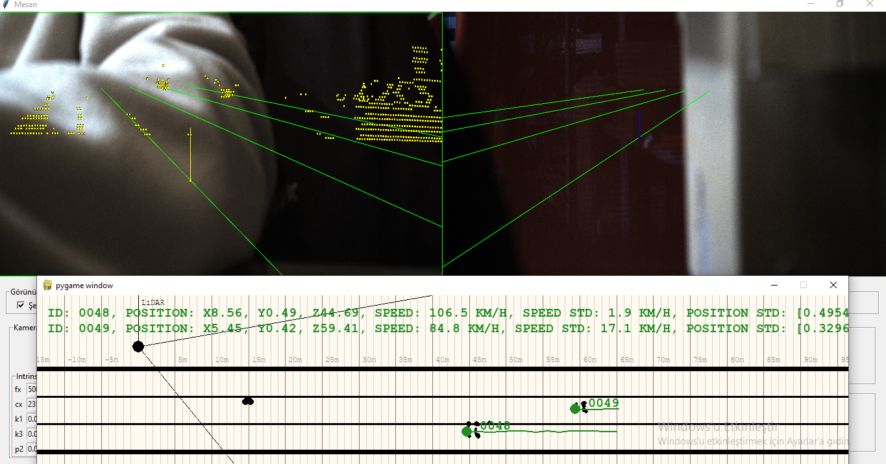
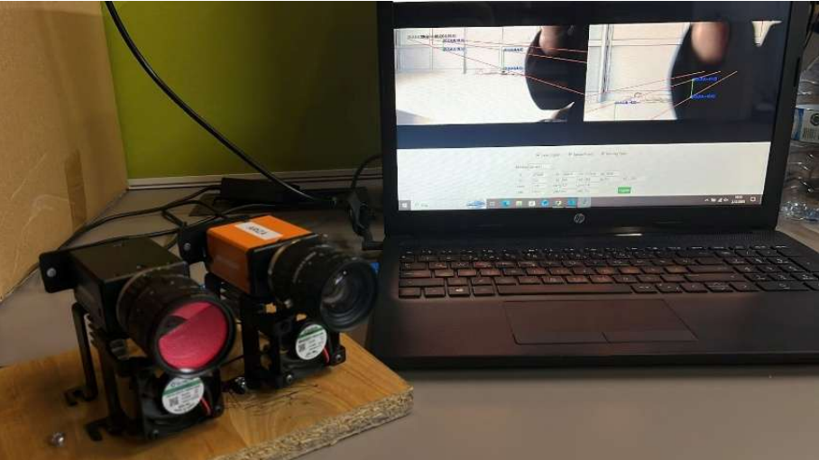
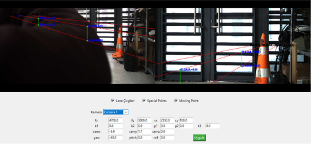
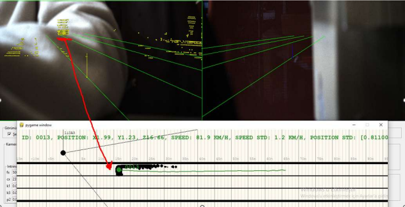
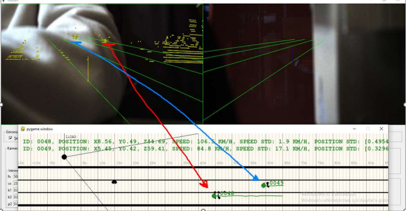

# LiDAR ve Kamera Tabanlı Algılama Sistemi

[](https://www.python.org/)


Bu depo, ikinci staj dönemimde LiDAR verilerinin işlenmesi, nesne tespiti,
çoklu nesne takibi ve LiDAR–kamera projeksiyonu üzerine yaptığım çalışmaları
göstermek için hazırlanmıştır. Projede asenkron veri akışı, filtreleme ve
görüntüleme adımlarını incelemek için çalıştırılabilir örnekler bulunur.

## İçindekiler

- [Projeler](#projeler)
- [Teknik akış](#teknik-akış)
- [Kullanılan teknolojiler](#kullanılan-teknolojiler)
- [Ekran görüntüleri](#ekran-görüntüleri)
- [Kurulum](#kurulum)
- [Proje yapısı](#proje-yapısı)
- [Staj kapsamında yaptığım çalışmalar](#staj-kapsamında-yaptığım-çalışmalar)
- [Sınırlamalar](#sınırlamalar)

## Projeler

### `lidar_detection_tracking`

LiDAR nokta bulutu üzerinde filtreleme, nesne tespiti ve çoklu nesne takip
algoritmalarını gösteren projedir.

Bu klasördeki örnekler sentetik verilerle çalışır ve aşağıdaki katkıları
gösterir:

- Yükseklik, ileri mesafe ve şerit/yol alanı filtreleri
- Şerit kenarlarından uzaklaştırma (`SHRINK`)
- Photon count ağırlıklı voxel filtreleme
- DBSCAN ile nokta kümelendirme
- Gürültü noktalarının ve küçük kümelerin ayrılması
- Nesne merkezi, standart sapma ve bounding box hesaplama
- İleri/lateral koordinatların çıkarılması
- Kalman tabanlı konum ve hız tahmini
- Hız yumuşatma ve hız değişimini sınırlandırma
- Hungarian Algorithm ile nesne eşleştirme
- Track oluşturma, doğrulama, kayıp track ve ID yönetimi

#### Filtreleme ve ön işleme

Noktaları öncelikle yükseklik, ileri mesafe ve yol/şerit alanına göre
sınırlandırdım. Şerit kenarlarından gelen noktaları azaltmak için `SHRINK`
uyguladım. Ağırlıklı voxel filtrelemede aynı voxel içindeki noktaları
birleştirirken `photon_count` değerini ağırlık olarak kullandım. Boş veya
geçersiz veri durumlarının pipeline’ı durdurmamasını sağladım.

#### Nesne tespiti

DBSCAN ile noktaları kümelere ayırdım. Gürültü noktalarını ve yeterli sayıda
nokta içermeyen kümeleri eledim. Geçerli kümelerden nesne merkezi, standart
sapma ve bounding box değerlerini çıkardım. Takipte kullanılacak ileri ve
lateral konum bilgilerini bu sonuçlardan oluşturdum.

#### Nesne takibi

Her nesne için Kalman filtresiyle konum tahmini yaptım ve yeni ölçümlerle
durumu güncelledim. Hız hesabında low-pass yumuşatma ve hız değişimini
sınırlandırma kullandım. Hungarian Algorithm ile yeni tespitleri mevcut
track’lerle eşleştirdim. Yeni track oluşturma, kayıp track’leri koruma veya
silme, doğrulama ve ID yönetimi kurallarını takip akışına ekledim.

Ayrıntılı açıklamalar için [algorithms.md](lidar_detection_tracking/docs/algorithms.md)
dosyasına bakılabilir.

### `camera_lidar_sensor_fusion`

LiDAR verisini kamera koordinat sistemine aktaran ve sonuçları kamera
ekranları üzerinde gösteren arayüz uygulamasıdır.

Uygulamada:

- LiDAR verisi `shared_data/lidar.data` dosyasından okunur.
- LiDAR noktaları dünya koordinatlarına dönüştürülür.
- Yükseklik ve ileri mesafe filtreleri uygulanır.
- Kamera iç ve dış parametreleri kullanılarak 3B noktalar 2B görüntüye
  projekte edilir.
- Şeritler, markerlar ve LiDAR noktaları kamera ekranında çizilir.
- Fiziksel kamera bulunamazsa JSON’daki görüntü boyutlarına göre siyah sanal
  kamera ekranları oluşturulur.
- Kamera görüntüleri en-boy oranı korunarak ekrana sığdırılır.

Fiziksel kamera sürücüsü bu açık projeye dahil değildir. Bu nedenle proje,
kamera takılı olmadığında da sanal siyah ekranlarla çalışabilir.

## Teknik akış

### LiDAR tespit ve takip akışı



### Kamera–LiDAR akışı



## Kullanılan teknolojiler

#### Ortak

- Python

#### LiDAR tespit ve takip

- NumPy
- SciPy
- scikit-learn
- DBSCAN
- Kalman filtresi
- Hungarian Algorithm

#### Kamera–LiDAR sensör füzyonu

- NumPy
- OpenCV
- Pillow
- Tkinter

## Ekran görüntüleri

Uygulamanın farklı çalışma ve test aşamalarından ekran görüntüleri:

| Görsel | Açıklama |
|---|---|
<table>
  <tr>
    <td align="center" width="50%">
      <br>
      <strong>Çift kamera ve LiDAR projeksiyonu</strong><br>
      İki kamera görüntüsü üzerine LiDAR nokta bulutunun ve şerit perspektif çizgilerinin 3B uzaydan 2B görüntü düzlemine aktarımı.
    </td>
    <td align="center" width="50%">
      <br>
      <strong>LiDAR projeksiyonu ve şerit doğrulaması</strong><br>
      Filtrelenmiş LiDAR noktalarının kamera görüntüsü üzerine aktarılması ve yol/şerit geometrisiyle birlikte kontrol edilmesi.
    </td>
  </tr>
  <tr>
    <td align="center">
      <br>
      <strong>Tek nesne takibi ve kuşbakışı görünüm</strong><br>
      Kamera–LiDAR görünümünün yanında tek hedefin (ID: 0013) konumu, Kalman tabanlı hız tahmini ve hareket geçmişinin gösterimi.
    </td>
    <td align="center">
      <br>
      <strong>Çoklu nesne takibi</strong><br>
      İki hedefin (ID: 0048 ve ID: 0049) aynı anda takip edilmesi; şerit konumu, hız ve konum belirsizliği bilgilerinin gösterimi.
    </td>
  </tr>
  <tr>
    <td align="center">
      <br>
      <strong>Donanım ve kamera test düzeneği</strong><br>
      Bilgisayar, kameralar ve algılama yazılımının birlikte kullanıldığı fiziksel test ortamı.
    </td>
    <td align="center">
      <br>
      <strong>Kamera kalibrasyon ve yol şeridi arayüzü</strong><br>
      Kamera iç ve dış parametrelerinin ayarlandığı, yol ve şerit çizimlerinin kontrol edildiği arayüz.
    </td>
  </tr>
  <tr>
    <td align="center">
      <br>
      <strong>Sensör füzyonu ve tek hedef eşleştirme</strong><br>
      Projeksiyondan elde edilen nokta kümesinin kuşbakışı takip görünümündeki tek araçla (ID: 0013) eşleştirilmesi.
    </td>
    <td align="center">
      <br>
      <strong>Çoklu hedef veri ilişkilendirme</strong><br>
      Farklı nokta kümelerinin kuşbakışı görünümde takip edilen araçlara (ID: 0048 ve ID: 0049) eşleştirilmesi.
    </td>
  </tr>
</table>

## Kurulum

Depoyu klonladıktan sonra ilgili proje klasörüne geçin ve o projenin sanal
ortamını oluşturun.

### LiDAR tespit ve takip projesi

```powershell
cd lidar_detection_tracking
python -m venv .venv
.\.venv\Scripts\Activate.ps1
python -m pip install -r requirements.txt
python -m examples.synthetic_pipeline_demo
```

Bu demo, kuruma ait gerçek LiDAR verilerine ihtiyaç duymadan sentetik örnek
verilerle filtreleme, nesne tespiti ve takip akışını gösterir.

### Kamera–LiDAR sensör füzyonu projesi

```powershell
cd camera_lidar_sensor_fusion
python -m venv .venv
.\.venv\Scripts\Activate.ps1
python -m pip install -r requirements.txt
python -c "from src.app.main import Main; Main.main()"
```

Bu proje, ana dizindeki `shared_data/lidar.data` dosyasını kullanır. Fiziksel
kamera bulunamazsa kamera görüntüleri yerine siyah sanal ekranlar gösterilir.

## Proje yapısı

```text
lidar-camera-perception-system/
├── camera_lidar_sensor_fusion/
│   ├── config/                 # Kamera, LiDAR, yol ve marker ayarları
│   ├── src/app/                # Uygulama başlangıcı ve cihaz yönetimi
│   ├── src/core/               # Projeksiyon ve temel işlemler
│   ├── src/domain/             # Kamera, LiDAR ve yapılandırma modelleri
│   ├── src/infrastructure/     # Veri okuma ve servisler
│   └── src/ui/                 # Görüntüleme ve ayar arayüzü
├── lidar_detection_tracking/
│   ├── public_algorithms/      # Açık filtreleme, tespit ve takip örnekleri
│   ├── examples/               # Sentetik veri demosu
│   └── docs/                   # Algoritma açıklamaları
├── shared_data/
│   └── lidar.data              # İki proje tarafından kullanılan LiDAR verisi
├── screenshots/                # README için uygulama ekran görüntüleri
└── README.md
```

## Staj kapsamında yaptığım çalışmalar

Staj kapsamında bana verilen başlangıç ve örnek kod yapısını inceleyerek
LiDAR filtreleme, nesne tespiti ve takip akışını geliştirdim. Bu çalışmaların
paylaşılabilir örnekleri
`lidar_detection_tracking/public_algorithms/` klasöründe yer almaktadır.

Kamera–LiDAR tarafında ise verilen başlangıç yapısı üzerinden veri akışının
arayüzde gösterilmesi, sanal kamera ekranlarının oluşturulması, kamera
projeksiyonu, çizimlerin ekrana aktarılması ve yapılandırma ayarlarının
yönetimi üzerine çalıştım.

## Sınırlamalar

- Gerçek kamera sürücüsü ve üretici SDK’sı paylaşılmamıştır.
- Fiziksel kamera olmadığında siyah sanal kamera görüntüsü kullanılır.
- LiDAR akışı örnek `shared_data/lidar.data` dosyası üzerinden oynatılır.
- Takip algoritmasının açık demosu sentetik verilerle çalışır.
